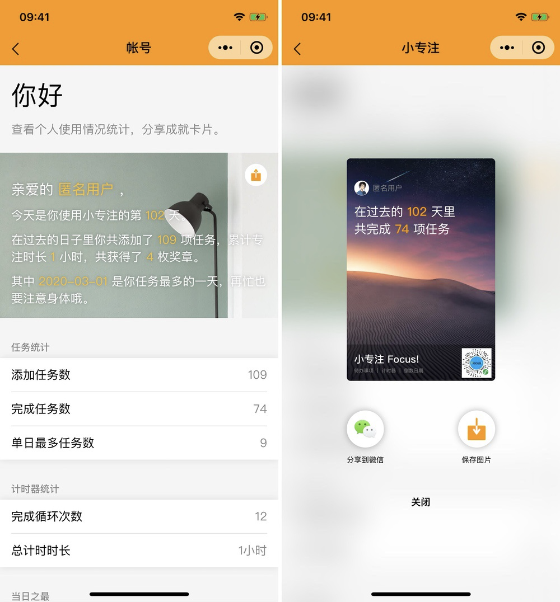

# 使用统计与帐号管理

在本产品中，我们支持云端同步用户的使用情况及用户任务列表。这不是一个强制性功能，如果用户希望启用云同步，只需要在设置页面点击登录并完成授权即可。用户完成授权后，「登录」按钮将变成带有用户昵称和头像的帐号管理链接。

.png>)

进入帐号管理，本产品将为用户展示其累计使用天数、累计任务数、完成任务数、计时器运行次数等基础信息。如有需要，用户可以生成海报图片并保存到手机。

